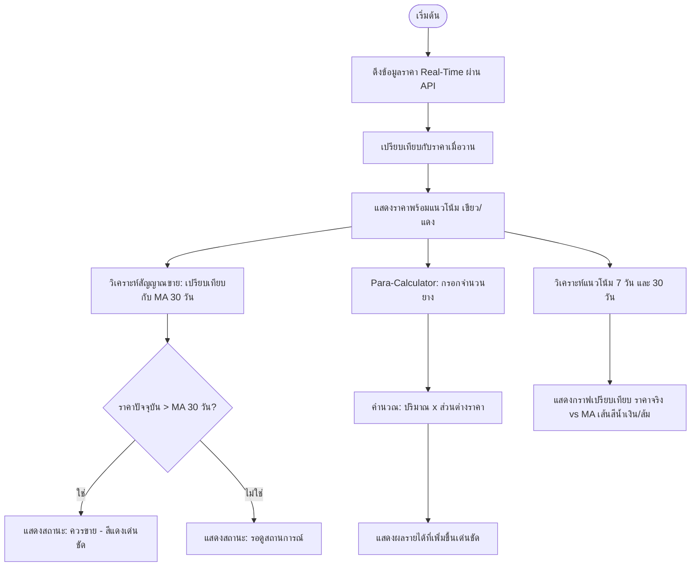

# 📈 YangParui (ยางพารวย)
> **ระบบแดชบอร์ดและแจ้งเตือนวิเคราะห์ราคายางพาราอัจฉริยะ (Smart Rubber Price Dashboard & Analytics)**

ระบบ **YangParui (ยางพารวย)** เป็นแพลตฟอร์มวิเคราะห์และแสดงผลราคายางพาราแบบเรียลไทม์ เพื่อช่วยให้เกษตรกรสามารถตัดสินใจขายยางพาราได้อย่างชาญฉลาดและได้กำไรสูงสุด (Data-Driven Decisions) ด้วยการเปลี่ยนข้อมูลราคาที่ซับซ้อนให้กลายเป็นแดชบอร์ดและสัญญาณเตือนที่เข้าใจง่าย

---

## 🌟 ฟีเจอร์หลักของระบบ (Key Features)

### 1. 📊 แดชบอร์ดราคาแบบเรียลไทม์ (Real-time Price Dashboard)
ระบบดึงข้อมูลผ่าน **Real-time API** เพื่อนำเสนอราคายางพาราที่อัปเดตล่าสุดทุก ๆ 5 นาที แยกตามประเภทอย่างชัดเจน พร้อมลูกศรชี้วัดแนวโน้มสีเขียว/แดง เพื่อเปรียบเทียบกับราคาเมื่อวาน

| ประเภทของยางพารา | ตัวอย่างราคาอ้างอิง | แนวโน้ม / ส่วนต่างราคา |
| :--- | :---: | :---: |
| 💧 **น้ำยางสด (Fresh Latex)** | `75.00 บาท/กก.` | 🔴 `-2.00 บาท` |
| 🫓 **ยางแผ่นดิบ (Raw Rubber Sheets)** | `80.50 บาท/กก.` | 🟢 `+1.50 บาท` |
| 🪣 **ยางก้อนถ้วย (Cup Lumps)** | `60.00 บาท/กก.` | 🔴 `-3.00 บาท` |

*ช่วยให้เกษตรกรเห็นส่วนต่างกำไรและทิศทางราคาได้ทันทีที่เปิดใช้งานระบบ*

---

### 2. 🚨 ระบบแจ้งเตือนจังหวะขายอัจฉริยะ (Smart Selling Alerts)
ฟีเจอร์ที่เป็นหัวใจหลักในการวิเคราะห์ข้อมูลเพื่อช่วยตัดสินใจ (Decision-Making Engine) โดยระบบจะคำนวณและเปรียบเทียบราคาวันนี้กับ **เส้นค่าเฉลี่ยเคลื่อนที่ 30 วัน (30-day Moving Average)**

*   **สถานะ "ควรขาย" (Sell Alert):** จะปรากฏขึ้นเป็น **สีแดงเด่นชัด** เมื่อราคาตลาดปัจจุบันสูงกว่าราคาเฉลี่ยสะสม 30 วัน ถือเป็นโอกาสทำเงินที่ดีที่สุด
*   **การแสดงผลเชิงเปรียบเทียบ:**
    *   **ราคาจริงปัจจุบัน:** เช่น `75.50 บาท/กก.`
    *   **เส้นค่าเฉลี่ยเคลื่อนที่ (30-day MA):** เช่น `70.20 บาท/กก.`
    *   *ระบบจะแสดงข้อความระบุชัดเจนว่า ราคาสูงกว่าค่าเฉลี่ย ถือเป็นโอกาสทองในการขายทำกำไร*

---

### 3. 🧮 เครื่องมือคำนวณเพิ่มรายได้ (Para-Calculator)
โปรแกรมคำนวณส่วนต่างกำไร (Profit Margin Calculator) ที่เน้นผลลัพธ์เชิงตัวเลข **"กำไรสุทธิเป็นเงินบาท"** เพื่อจูงใจและอำนวยความสะดวกให้เกษตรกรโดยไม่ต้องคำนวณเอง

*   **วิธีการใช้งาน:** เกษตรกรเพียงกรอกปริมาณยางที่คาดว่าจะขาย (เช่น `1,000 กก.`)
*   **ระบบคำนวณผลประโยชน์ที่จับต้องได้ (Tangible Profit):**
    *   **ราคาขายวันนี้:** `72.50 บาท/กก.`
    *   **ราคาเดิมที่เคยขาย:** `68.00 บาท/กก.`
    *   **ส่วนต่างกำไรต่อหน่วย:** `+4.50 บาท/กก.`
    *   **ไฮไลท์สำคัญ (รายได้เสริมที่เพิ่มขึ้น):** **`4,500 บาท!`** (แสดงผลลัพธ์แบบเน้นย้ำ เด่นชัดที่สุด เพื่อสร้างความมั่นใจในการขาย)

---

### 4. 📈 วิเคราะห์แนวโน้มและสัญญาณทางเทคนิค (Market Trend Analysis)
แดชบอร์ดวิเคราะห์ทิศทางตลาดเพื่อการวางแผนระยะยาว โดยแบ่งเป็น 2 ช่วงเวลาหลัก:

#### 🗓️ แนวโน้มระยะสั้น (7 วัน)
*   **สถานะแนะนำ:** `"ควรขาย"` (เมื่อเส้นราคาจริงตัดขึ้นเหนือเส้นค่าเฉลี่ย)
*   **ข้อมูลประกอบ:** ระบุราคาเฉลี่ยสะสม 7 วัน (เช่น `71.00 บาท/กก.`) และราคาสูงสุดในรอบสัปดาห์ (เช่น `75.50 บาท/กก.`)

#### 🗓️ แนวโน้มระยะกลาง (30 วัน)
*   **สถานะแนะนำ:** `"รอดูสถานการณ์"` (Hold/Monitor) เพื่อรอดูทิศทางราคา
*   **การวิเคราะห์ทางเทคนิค:** แสดงสัญญาณจุดตัดสีทอง (Golden Cross), ระบุช่วงราคาที่มีความผันผวนสูง และจุดแนวรับ-แนวต้านสำคัญ
*   **รายละเอียดกราฟ:** กราฟจะแสดงเปรียบเทียบระหว่าง **เส้นราคาจริง (สีน้ำเงิน)** และ **เส้นค่าเฉลี่ยเคลื่อนที่ Moving Average (สีส้ม)** เพื่อให้เห็นสัญญาณการตัดกันเพื่อตัดสินใจอย่างมีประสิทธิภาพ

---

## 🛠️ แผนภาพกระบวนการทำงานของระบบ (System Workflow)

